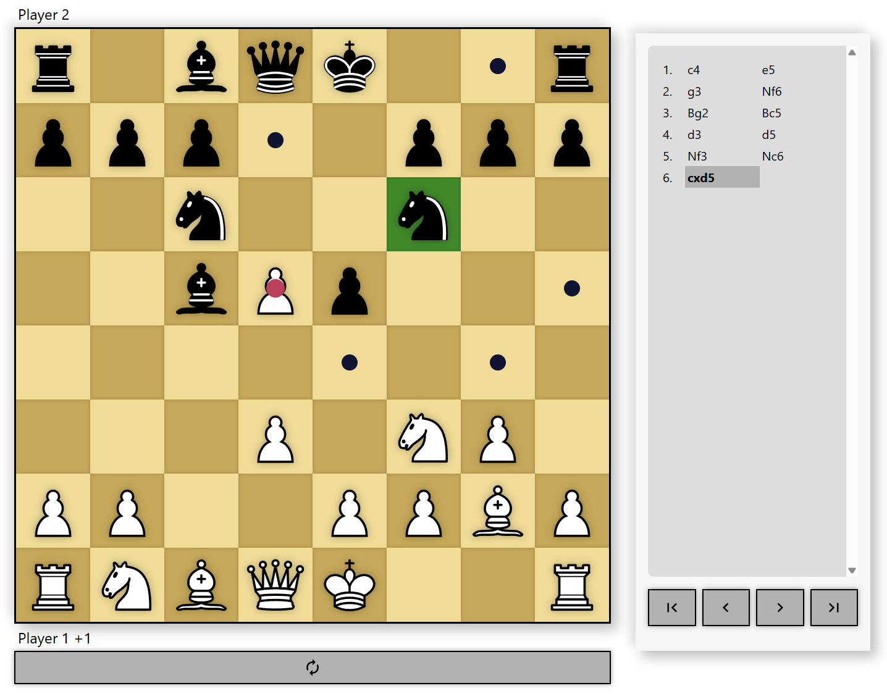
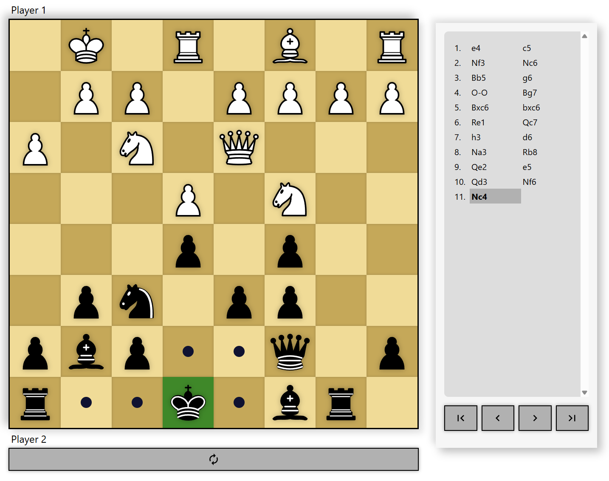
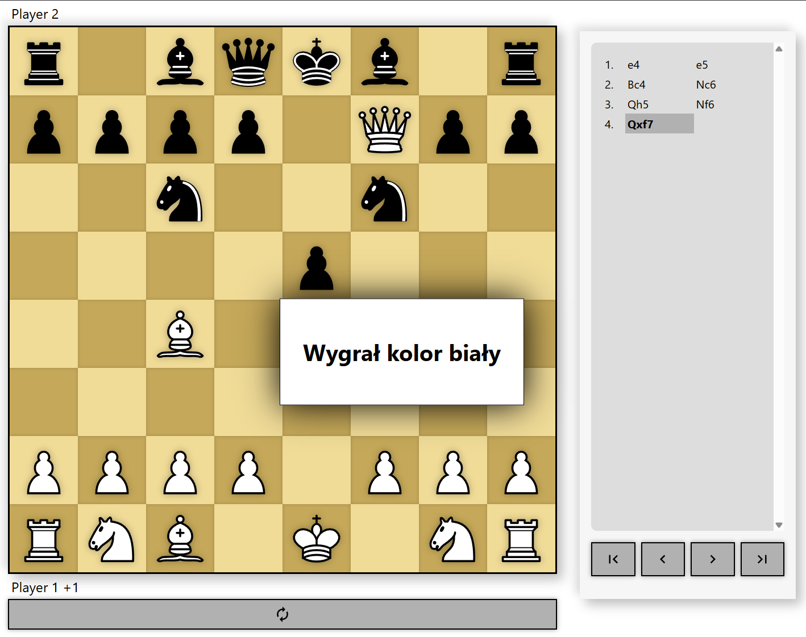

# Chess in React.js [EN]

Chess application built in 2022 as part of learning React and experimenting with creating a chess engine.

## Features

- Highlights all legal moves for the selected piece.
- Tracks material difference and displays it next to the player with the advantage.
- Saves move history, which can be navigated by clicking on a move or using arrow controls in the menu.
- Allows changing the board perspective to the other player.
- Detects game outcomes (checkmate, stalemate).

---

# Szachy w React.js [PL]

Aplikacja szachowa stworzona w 2022 roku w ramach nauki React i eksperymentów z tworzeniem silnika szachowego.

## Funkcje

- Podświetla wszystkie legalne ruchy dla wybranej figury.
- Śledzi różnicę materiału i pokazuje ją przy graczu mającym przewagę.
- Zapisuje historię ruchów, którą można przeglądać klikając na ruch lub używając strzałek w menu.
- Pozwala zmienić perspektywę planszy na drugiego gracza.
- Wykrywa wynik gry (mat, pat).

---

# App Page | Strona Aplikacji

If you want to try it out yourself, here’s the link [EN] \
Jeśli chcesz wypróbować aplikację samodzielnie, oto link [PL] \
[chess_react on github pages](https://andrzejjanaszek.github.io/chess_react/)

---

# App Images | Zdjęcia Aplikacji

### Move highlighting | Podświetlanie ruchów

### Other player perspective | Perspektywa drugiego gracza

### Mate | Mat

